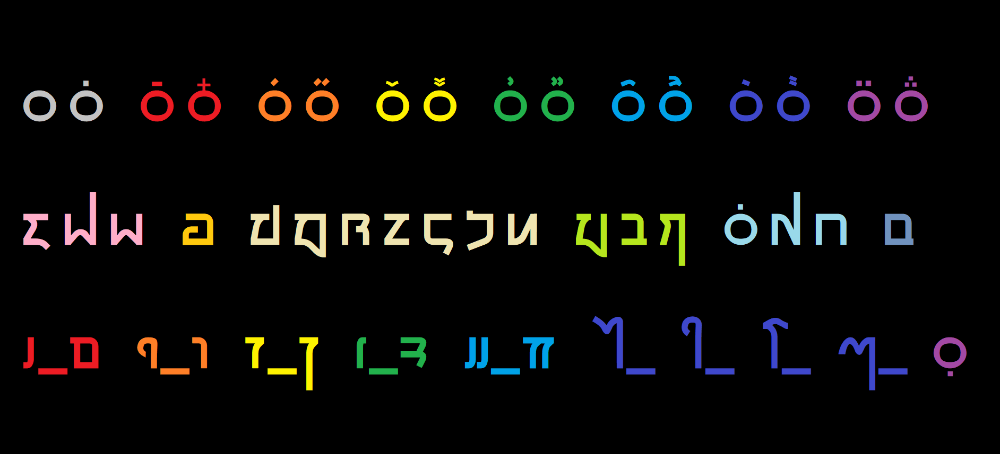

<style>
@font-face {
  font-family: 'ToaqScript';
  src: url(fonts/ToaqScript.ttf);
}
u {
  text-decoration: none;
  font-family: ToaqScript;
  font-size: 150%;
}
</style>

<h1 style="margin: 0 auto; font-size: 500%; font-family: ToaqScript">EhNoykR</h1>

<b>ToaqScript</b>, hereafter referred to as Hoekai, is a writing system developed by **mi Hoenmair**.

*Note: the following is not endorsed by **mi Hoenmair** himself. Not only that, but most of the linked material is his. I am sharing it under his permission. All credit should go to him, not me.*

@@toc@@

## Description

**Mi Hoenmair** has shared a list of glyphs in a PDF. You can get it [here](assets/script-sheet.pdf).

A Toaq syllable is analysed into four Hoekai parts:
1. the consonant, which becomes the glyph in the middle;
2. the first phoneme in the nucleus, which is written right of the consonant (unless it is **a**, in which case it should be omitted);
3. the rest of the nucleus, written left of the consonant (optional);
4. the tone, together with the coda (presence/absence of **-q**), written above. (This part is empty for neutral tone syllables without **-q**.)

Note that if the entire nucleus is a diphthong – one of **-ai, -ao, -oi, -ei** – it is treated as a `(3)`.

### Reference sheet



In this reference sheet, there are three rows:
1. All the tones with and without **-q** (`(4)` in the list above), in the usual order.
2. All the consonant glyphs (`(1)` in the list above), in this order: **m p b – f – n t d c s r l – ch j sh – q k g h**.
3. All the vowel and diphthong glyphs (`(2)` and `(3)`), in this order: **a u i o e ai ao oi ei**.

The circle ‘consonant’ signifies the lack of a consonant; an underdot signifies the lack of a vowel. This is the reason why **q** from the second row was written as a null consonant + **-q**.

## Font files

Get the latest version: [v0.331](fonts/ToaqScript.ttf).

The reference sheet from above is typed as follows:
```
q qQ  qR qL  qP qB  qX qZ  qN qM  qT qD  qK qG  qF qV 
m p b  f  n t d c s r l  w j x  qQ k g  h 
A_a  U_u  I_i  O_o  E_e  y_  v_  z_  W_  qY
```

1. Consonants stay as they are, with the exception of the two digraphs, **ch** and **sh**, which are mapped to `w` and `x` respectively.
2. First vowels stay as they are.
3. Last vowels are capitalised, with **-ai -ao -oi -ei** mapped to `y v z W` respectively.
4. The tone mark (if present) is written with a capital letter – the corresponding [Vietoaq](vietoaq.md) final. In short: **aq ā āq á áq ǎ ǎq ả ảq â âq à àq ã ãq** are mapped to `Q R L P B X Z N M T D K G F V`.

`(3)` comes first, then `(1)`, then `(4)`, then `(2)`. The null consonant (circle) is `q`; the null vowel (underdot) is `Y`. The first sentence from the sample text below would be `pFuvjR bi EmNi s xPi yrNuAjLo AdXo tKi tu lPu pM AhPo AgPu n, AdTugRi AhPo d`.

Automated ways of converting plain Toaq into ToaqScript input will be made publicly available soon. Currently, [the Discord bot](nuogai.md) can generate an image of the script for you: use `%hoe` with plain Toaq as input.

## Sample text

(Note: The Toaq font is rendered at 150% of its nominal size.)

> <u>pFuvjR bi EmNi s xPi yrNuAjLo AdXo tKi tu lPu pM AhPo AgPu n, AdTugRi AhPo d.</u>
> > **Pufjaor bi mien sa ship ruainjoal doax tik tu lup pam hoap guap na, duatgir hoap da.**  
>
> <u>bNu ygN hPo Asi yrP n, ru dNu tNiAtRu bB cu hPo nBivdR rZ AhPo sBo IxNu n, OpKe OrPi d.</u>
> > **Bun gain hop sia raip na, ru dun tintuar bab cu hop nibdaor raz hoap sob shuin na, peok riop da.**  
>
> <u>Oke dMu hPo s AjPu d. </u>
> > **Keo dum hop sa juap da.**  
>
> <u>vrK tu wB EbKi wDu hPo OrBehL n, vrK tTiAxRe tBoAfRu n, ru tNi Asi AmPeOhRe bi, ydNu tNiAtRu s xPi AwMe ElMuwRe s xPi AmNeOhRe hM d.</u>
> > **Raok tu chab biek chud hop reobhal na, raok titshear tobfuar na, ru tin sia meapheor bi, duain tintuar sa ship cheam luemcher sa ship meanheor ham da.**  
>
> <u>Oke mu EtNi mB n, ru AjMu bNu AdNu ElBuwRe hDe mB hi yrP d.</u>
> > **Keo mu tien mab na, ru juam bun duan luebcher hed mab hi raip da.**  
